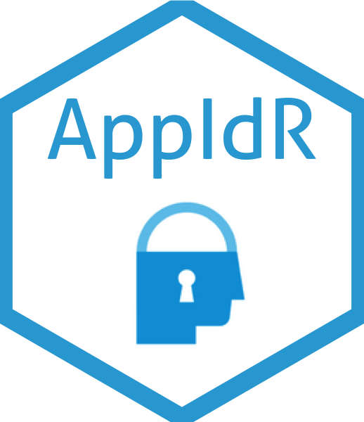

# AppIdR 

<!-- badges: start -->

[](https://www.tidyverse.org/lifecycle/#experimental)
[](https://github.com/th1460/appId/actions)
<!-- badges: end -->

The `AppIdR` is a package to get authentication with [App ID
IBM](https://www.ibm.com/cloud/app-id) service in the Shiny Apps.

## Install

``` r
remotes::install_github("IBM/AppIdR")
```

## Configure

In the first, you need generate a config yaml file with:

``` r
gen_appid_config(name = "Myapp")
```

And resulting

    # appid_config.yml

    name: Myapp
    config:
      key: !expr Sys.getenv("APPID_KEY") # clientId
      secret: !expr Sys.getenv("APPID_SECRET") # secret
      redirect_uri: !expr Sys.getenv("APP_URL") # app url
      base_url: !expr Sys.getenv("APPID_URL") # oAuthServerUrl
      authorize: authorization
      access: token
      scope: openid
      password: !expr Sys.getenv("SECRET") # encrypt token

You should too, create a `.Renviron` file with the credentials.

## Example

``` r
require(shiny)
require(shinydashboard)
require(appId)

ui <- dashboardPage(
  dashboardHeader(user_info(), # show user info
                  title = "My dashboard"),
  dashboardSidebar(),
  dashboardBody()
)

server <- function(input, output, session) {

  # if you want get user info in app
  userinfo <- callModule(get_user_info, "userinfo")
  output$user <- renderText({userinfo()})

}

# modified shinyApp
shinyAppId(ui, server)
```

## References

1.  Package using Auth0 service
    [curso-r/auth0](https://github.com/curso-r/auth0)
2.  Sketch of Shiny + Oauth
    [hadley/shiny-oauth.r](https://gist.github.com/hadley/144c406871768d0cbe66b0b810160528)
